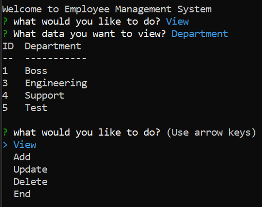
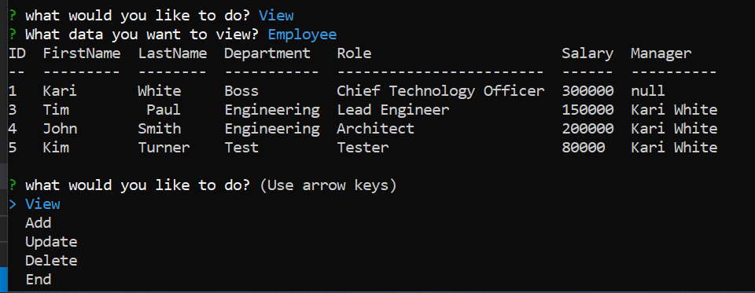
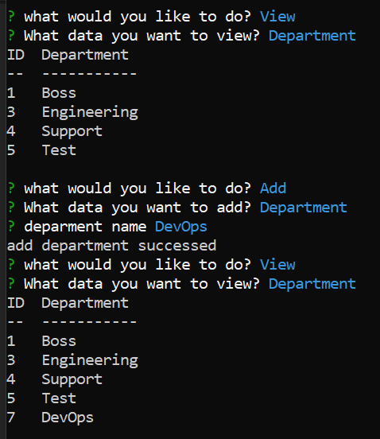
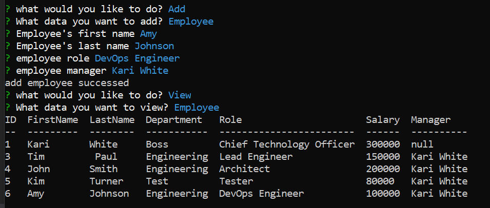
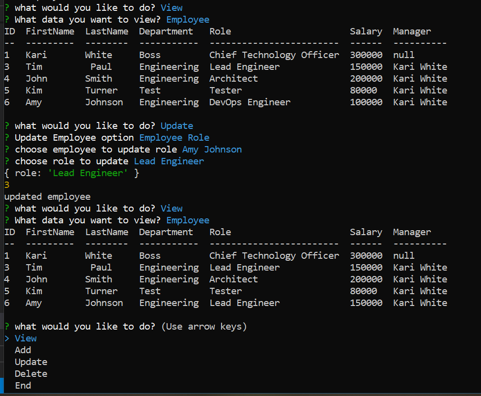

# 12 SQL: Employee Tracker


### Project Description

* This is a Content Management System to view and manage the departments, roles, and employees in the company.
* The application uses MySQL to content all the company database, and Node.js to view and manage the SQL database.


### Install
```md
npm install
```
### MySQL 
```
mysql -u root -p
source SQL/schema.sql;
source SQL/seed.sql;
exit
```
### Usage

1. node app.js


2. View

* Department

 

* Role

 

* Employee

 

3. Add

* Department

 

* Role

 

* Employee

 

4. Update Employee data

* Update Employee Role

 

### Language
```md
Javascrpit
Node.js
MySQL
```

